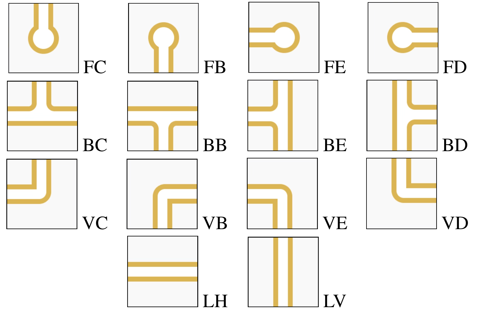

# PipeMania Solver

Welcome to our PipeMania Solver project! 🚀

## Overview

This project aims to solve instances of the PipeMania puzzle game using artificial intelligence algorithms. PipeMania is a puzzle game where you need to connect pipes to form a complete pipeline without any leaks.

## How It Works

The program reads an instance of PipeMania from the standard input in the specified format:

It then applies an AI algorithm to find the solution, i.e., the arrangement of pipes that forms a complete pipeline with no leaks.

## Usage

To use the program, follow these steps:

1. Clone the repository to your local machine.
2. Navigate to the directory containing the `pipe.py` script.
3. Run the `pipe.py` script with an input file as follows:

   `python pipe.py <input-file.txt>`

   Replace `<input-file.txt>` with the path to your input file containing the PipeMania grid.

